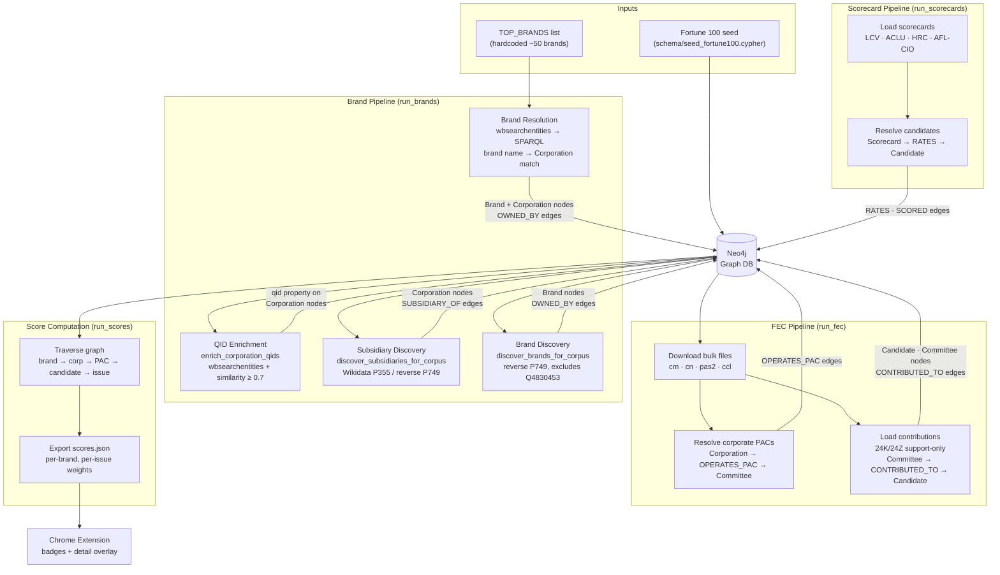

# Political Purchaser

A browser extension + backend system that shows the political spending trail behind products you browse on Amazon. Unlike existing tools, this system is **configurable by policy issue** rather than simple party alignment, and it **exposes the full money trail as a visual graph**.

## How It Works

1. You browse Amazon as usual
2. Score badges appear next to brand names on search results and product pages
3. Click a badge to see the full money trail: brand → corporation → PAC/executives → candidates → issue scores
4. Configure which issues matter to you and which scorecards you trust

## Architecture

```
Amazon Page ──► Extension (badges from cached scores)
                   │
                   ▼ (click for details)
              FastAPI ──► Neo4j Graph DB
                          (brand → corp → PAC → candidate → issue)
                              ▲
                              │
                      Weekly Pipeline
                    (FEC + Wikidata + Scorecards)
```

### Pipeline Data Flow



### Components

- **Data Pipeline** (`pipeline/`) — Fetches FEC campaign finance data, resolves brands to corporations via Wikidata/OpenCorporates, loads legislative scorecards, and pre-computes per-brand issue scores
- **Neo4j Graph DB** — Stores the full ownership and money trail as a queryable graph
- **FastAPI Backend** (`api/`) — Serves score lookups and live graph trail queries
- **Chrome Extension** (`extension/`) — Injects score badges on Amazon, shows detail overlay with full money trail

## Quick Start

### Prerequisites

- Docker & Docker Compose
- Python 3.12+
- A free [FEC API key](https://api.open.fec.gov/developers/) (optional, `DEMO_KEY` works for development)

### Setup

```bash
# Clone and configure
cp .env.example .env
# Edit .env with your API keys (optional)

# Start Neo4j
docker compose up -d neo4j

# Install Python dependencies
pip install -e ".[dev]"

# Run the full pipeline (schema + brands + FEC + scorecards + scores)
python -m pipeline.run_pipeline

# Or run individual steps in order:
python -m pipeline.run_pipeline --steps schema      # Apply constraints, seed issues + Fortune 100 corps
python -m pipeline.run_pipeline --steps brands      # Resolve brands → corporations (cached)
python -m pipeline.run_pipeline --steps fec         # Load FEC bulk data (skips already-loaded cycles)
python -m pipeline.run_pipeline --steps scorecards  # Load legislative scorecards
python -m pipeline.run_pipeline --steps scores      # Pre-compute and export scores

# Start the API
uvicorn api.main:app --reload
```

### Install the Extension

1. Open `chrome://extensions/`
2. Enable "Developer mode"
3. Click "Load unpacked" and select the `extension/` directory
4. Browse Amazon — score badges will appear next to brand names

## Pipeline Steps

Run all steps or individual steps:

```bash
# All steps (default)
python -m pipeline.run_pipeline

# Individual steps (run in order)
python -m pipeline.run_pipeline --steps schema       # Apply Neo4j constraints + seed Fortune 100 corps
python -m pipeline.run_pipeline --steps brands       # Resolve brands → corporations via Wikidata/OpenCorporates
python -m pipeline.run_pipeline --steps fec          # Load FEC campaign finance data (incremental)
python -m pipeline.run_pipeline --steps scorecards   # Load legislative scorecards
python -m pipeline.run_pipeline --steps scores       # Pre-compute and export scores

# Force-reload FEC data even if already loaded
python -m pipeline.run_pipeline --steps fec --force
```

## API Endpoints

| Method | Endpoint | Description |
|--------|----------|-------------|
| GET | `/health` | Health check |
| GET | `/api/v1/scores/{brand}` | Get scores for a brand |
| GET | `/api/v1/scores?q=` | Search scores by brand name |
| GET | `/api/v1/trail/{brand}` | Full money trail (PAC + executive paths) |
| GET | `/api/v1/graph/{brand}` | Graph nodes/edges for visualization |
| GET | `/api/v1/config/{user_id}` | Get user preferences |
| PUT | `/api/v1/config/{user_id}` | Update user preferences |
| GET | `/api/v1/config/issues/available` | List available issues and scorecards |

## Configurable Issue Scoring

The system uses legislative scorecards from organizations across the political spectrum. Users choose which scorecards they trust:

| Scorecard | Issue | Status |
|-----------|-------|--------|
| League of Conservation Voters | Environment | Implemented (CSV fetcher) |
| ACLU | Civil Liberties | Pending (manual JSON file required) |
| EFF | Digital Rights | Pending (manual JSON file required) |
| Human Rights Campaign | LGBTQ+ Rights | Planned |
| AFL-CIO | Labor | Planned |

This is how the tool stays politically neutral — it surfaces data, and users decide what matters.

## Data Sources

- **FEC Bulk Data** — PAC contributions (committee master, candidate master, pas2, ccl); individual contributions deferred to Tier 2
- **Wikidata SPARQL** — Corporate ownership and subsidiary relationships
- **OpenCorporates** — Company registry data across 145 jurisdictions
- **Legislative Scorecards** — Issue ratings from advocacy organizations

## Known Limitations

- **Dark money blind spot**: 501(c)(4) donations are not disclosed to the FEC and cannot be tracked. The UI is transparent about this.
- **Amazon-only** for MVP. Other retailers may be added later.
- **Brand resolution is imperfect**: Some brand names are ambiguous or don't map cleanly to corporate entities.

## Testing

```bash
pip install -e ".[dev]"
python -m pytest tests/ -v
```

## Project Structure

```
├── api/                    # FastAPI backend
│   ├── main.py
│   └── routes/             # Score, graph trail, and config endpoints
├── extension/              # Chrome Manifest V3 extension
│   ├── manifest.json
│   ├── content.js          # Amazon page badge injection
│   ├── background.js       # Service worker for cache/API
│   ├── popup.html/js       # Settings UI
│   └── badge.css
├── pipeline/               # Data pipeline
│   ├── config.py
│   ├── fetchers/           # FEC, Wikidata, OpenCorporates, scorecards
│   ├── processors/         # Entity resolution, score computation
│   ├── loaders/            # Neo4j graph loaders
│   └── run_pipeline.py     # Orchestrator
├── schema/                 # Neo4j schema and seed data
├── scripts/                # One-time utility scripts
├── tests/
├── docker-compose.yml
└── pyproject.toml
```

## License

See [LICENSE](LICENSE).
